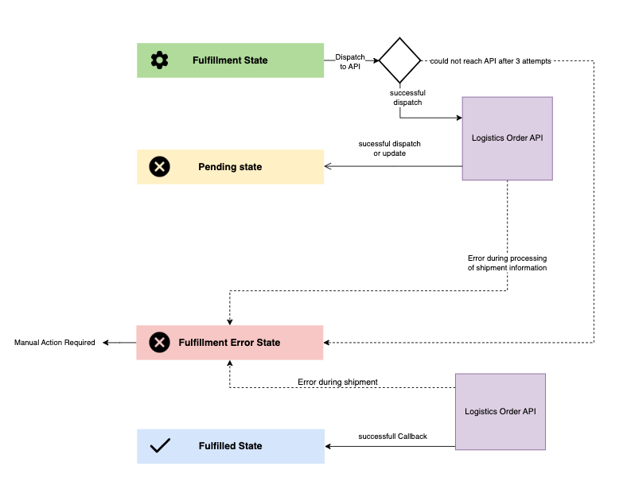

# How the Plugin works

A high-level overview for the combined process of ordering and shipping an item via Gebrüder Weiss looks like this:

1. A customer orders something in the WooCommerce store.
2. The status for the order gets set to the [fulfillment state](./setup#settings-tab-fullfillment). This can happen as a result of one of the following two events:
	1. The payment processor receives the payment for the order and updates the order state. to the fullfillment state *(this would be the default processing state from woocommerce)*
	2. The shop manager updates the status manually. *(this would be done if pay by check or something similar is activated)*
3. During the state transition, the WooCommerce Plugin triggers an API Call to the Gebrüder Weiss API to trigger shipping for the order and sets the order state to [pending state](./setup.md#settings-tab-fullfillment). Depending on the success of the API call, the flow is different from here:
	1. If the request is successful, state transition progresses to the [pending state](./setup.md#settings-tab-fullfillment), and the flow continues with step 4.
	2. If the request fails, a retry flow gets started:
		1. The request gets added to a failed requests queue.
		2. Every five minutes, the requests in this queue get retried.
		3. If the request is successful, this subflow ends.
		4. If a **request fails** for the third time, a **notification is sent to the store owner**, and the order state gets set to the [fullfillment error state](./setup.md#settings-tab-fullfillment).
4. Once the shipping is created, the Gebrüder Weiss triggers a WebHook that calls a REST endpoint provided by the plugin (`{WORDPRESS_REST_API_BASE_URL}/gebrueder-weiss-woocommerce/v1/orders/{WOOCOMMERCE_ORDER_ID}/callbacks/success`).
	1. The plugin attaches the Gebrüder Weiss shipping id to the order. This will be saved in the custom field defined in the [Order Id Field](./setup.md#settings-tab-order)
	2. The plugin attaches shipping status URL to the order. This will be saved in the custom field defined in the [Tracking Link Field](./setup.md#settings-tab-order)
	3. The plugin attaches the carrier information to the order. This will be saved in the custom field defined in the [Tracking Link Field](./setup.md#settings-tab-order)
5. Once the Gebrüder Weiss has shipped the item, they trigger another WebHook that calls a REST endpoint provided by the plugin (`{WORDPRESS_REST_API_BASE_URL}/gebrueder-weiss-woocommerce/v1/orders/{WOOCOMMERCE_ORDER_ID}/callbacks/fulfillment`).
6. The order state gets updated to the [fullfilled state](./setup.md#settings-tab-fullfillment).

*Figure 1: State Diagram of the Gebrüder Weiss Woocommerce Plugin*
